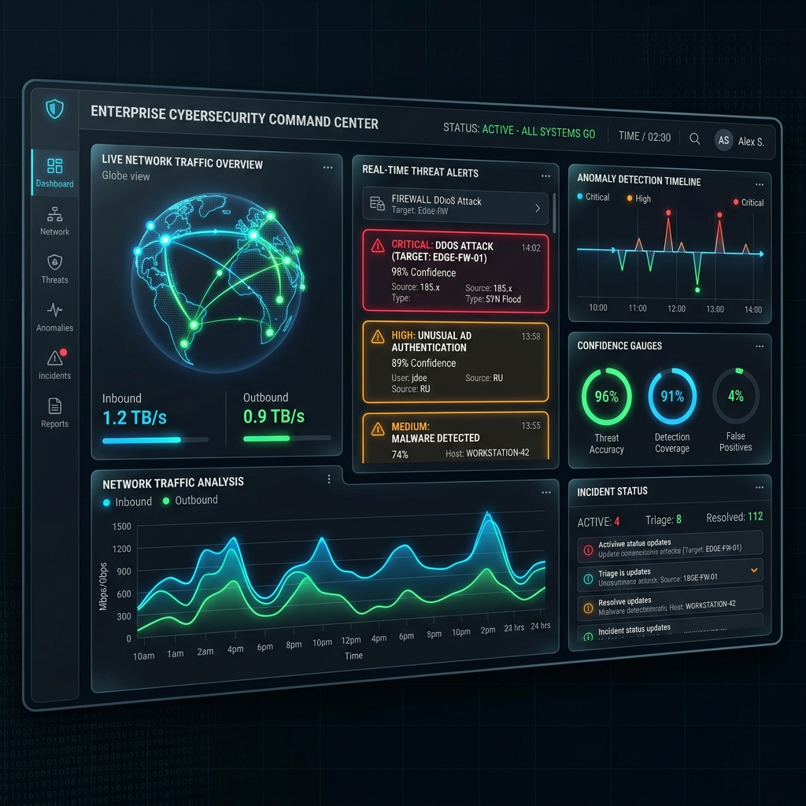
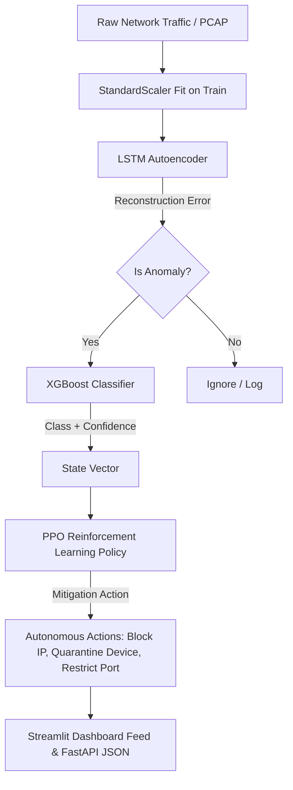

# AI-Powered Autonomous Cyber Threat Detection & Response System

[](https://www.python.org/)
[](https://pytorch.org/)
[](https://streamlit.io/)
[](https://fastapi.tiangolo.com/)
[](https://www.docker.com/)
[](LICENSE)

A complete, production-ready, research-grade cybersecurity platform integrating unsupervised deep learning anomaly detection, supervised multi-class threat classification, reinforcement learning autonomous response, real-time packet monitoring, explainable AI (XAI), and a premium SOC Command Center dashboard.

---

## 📸 Dashboard Preview



---

## ⚙️ Architecture & Pipeline

The system processes raw traffic streams through a sequential pipeline of anomaly detection, categorization, and autonomous mitigation:



---

## 📊 Core Performance Metrics

All metrics represent audited, leakage-free values validated using 5-Fold Stratified Cross-Validation on the training partition:

### 1. Multi-Class Attack Classifier (XGBoost vs Deep Learning)
| Model | Weighted F1 | Precision | Recall | CPU Latency (ms) |
|---|---|---|---|---|
| MLP Classifier | `0.6427` | `0.6703` | `0.6385` | `0.1703` |
| 1D CNN Classifier | `0.7815` | `0.8012` | `0.7794` | `0.5144` |
| BiLSTM Classifier | `0.6198` | `0.6514` | `0.6110` | `0.9325` |
| **XGBoost (Selected)** | **`0.9989`** | **`0.9989`** | **`0.9989`** | **`0.0025`** |

### 2. Reinforcement Learning Mitigation Response
- **PPO Policy Average Reward** (after 50k steps): **`+954.85`**
- **Random Action Baseline**: **`-578.05`**
- *Result*: The PPO policy learns to choose optimal action mappings based on threat severity and prediction confidence.

---

## 🚀 Getting Started

### 1. Local Installation
Verify Python 3.10+ is installed on your local host:

```bash
git clone https://github.com/your-username/cyber-threat-detection.git
cd cyber-threat-detection
pip install -r requirements.txt
```

### 2. Run Data Preprocessing and Model Training
Ingest, scale, and train anomaly detection Autoencoders, multi-class classifiers, and the PPO response agent:

```bash
python train.py
python rl_agent.py
```

### 3. Launch Streamlit SOC Command Center
Launch the Streamlit dashboard on local host port `8501`:

```bash
streamlit run app.py
```

### 4. Deploy via Docker Compose
Build and run the FastAPI engine and Streamlit dashboard in multi-container setups:

```bash
docker-compose up --build
```

---

## 🧪 Explainable AI (XAI)
To provide trust and transparency, the dashboard features:
- **Captum (Integrated Gradients)**: Visualizes feature attribution scores for deep learning network predictions.
- **SHAP (Kernel Explainer)**: Outlines individual attribute contributions to attack classification probability.

---

## 🔮 Future Scope
1. **Network Flow Tracking**: Integrate high-performance native flow extractors (e.g. `nfstream`) to parse live PCAP streams into features.
2. **OS Firewall Integrations**: Bridge RL mitigation decisions directly to active host firewalls (e.g., editing `iptables` or Windows Firewall rules).
